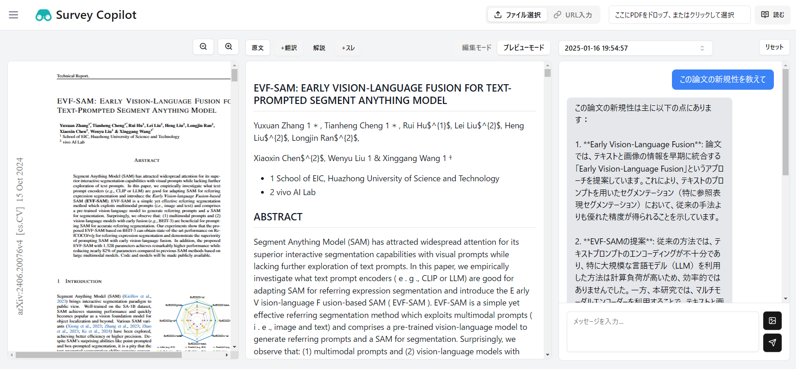

# Survey Copilot



論文調査のサポートを行います

## 主な機能
- PDF論文のマークダウン化
- 日本への翻訳
- 論文の内容に関するAIチャット

## 事前準備

### 環境変数設定

#### .env
- サーバーを起動するマシンのIPアドレス
- `.env_tempalte`からコピーする

    ```
    VITE_APP_IP = "XX.XX.XX.XX"
    ```

#### backend/.env
- `LLMのAPI`
- `backend/.env_tempalte`からコピーする

    ```
    # openai
    OPENAI_API_KEY=""

    # azure openai
    OPENAI_API_TYPE="azure"
    AZURE_OPENAI_API_KEY=""
    AZURE_OPENAI_API_VERSION="2024-04-01-preview"
    OPENAI_API_VERSION="2024-04-01-preview"
    AZURE_OPENAI_ENDPOINT="gpt-4o-mini"
    AZURE_CHAT_DEPLOYMENT="gpt-4o-mini"
    AZURE_EMBEDDING_DEPLOYMENT="text-embedding-3-large"
    AZURE_EMBEDDING_MODEL_NAME="text-embedding-3-large"
    ```

### ユーザーIDの設定

#### backend/allowed_users.txt
- アクセス可能なユーザーIDの設定
- `backend/allowed_users_template.txt`からコピーする

    ```
    test_user1
    test_user2
    ```

## スタート

### Docker環境

``` bash
# コンテナ起動
docker compose up -d --build

# バックエンドのコンテナ入る
docker exec -it survey_copilot_backend_ct bash

# フロントエンドエンドのコンテナ入る
docker exec -it survey_copilot_frontend_ct bash
```

### バックエンド側

OpenAI APIを使用する場合
``` bash
# バックエンドサーバー起動
python server.py
```

Azure OpenAI APIを使用する場合
``` bash
# バックエンドサーバー起動
python server.py --aoai
```

### フロントエンド側

``` bash
# 初回のみ
npm install

# フロントエンドサーバー起動
npm run dev
```

### アクセス
`http://XX.XX.XX.XX:5600`にアクセス


